# The Azulita House: A Website Architecture Guide

> **Target Audience**: Technically smart people new to web design
> **Metaphor**: Think of this website as a bilingual house where every room has an English side and a Spanish side

---

## 🏠 The Big Picture: Your Bilingual House

Imagine Azulita is a house with multiple rooms (pages). The house has two identical floor plans—one English, one Spanish—and visitors can switch between them at any time using a magic toggle switch (the language selector).


**Key Insight**: Whether you enter through the English door (`/about`) or Spanish door (`/es/about`), you see the _same room_, just with different language on the walls.

---

## 🚪 The Entrance: How Routes Work

Think of website URLs as different entrances to your house:

```
🏠 The House (www.azulita.com)
├── 🚪 / (English front door → Home)
├── 🚪 /about (English side entrance → About)
├── 🚪 /services (English service entrance → Services)
│
└── 🌮 /es/ (Spanish section of the house)
    ├── 🚪 /es/ (Spanish front door → Home)
    ├── 🚪 /es/about (Spanish side entrance → About)
    └── 🚪 /es/services (Spanish service entrance → Services)
```

**The Magic**: When you flip the language toggle, it's like walking through a secret passage from the English version of a room to the Spanish version. The furniture (components) stays the same, but all the pictures and writing on the walls change.


---

## 🧱 The Structure: Folders as Blueprints

Here's how the house is organized in the file system:

```
azulita/
├── 📐 app/                    (The floor plans - route files only)
│   ├── layout.tsx            (Blueprint for English side)
│   ├── page.tsx              (Home route - English)
│   ├── about/page.tsx        (About route - English)
│   ├── services/page.tsx     (Services route - English)
│   └── es/                   (Spanish wing of the house)
│       ├── layout.tsx        (Blueprint for Spanish side)
│       ├── page.tsx          (Home route - Spanish)
│       ├── about/page.tsx    (About route - Spanish)
│       └── services/page.tsx (Services route - Spanish)
│
├── 🪑 components/             (Reusable furniture - actual page content)
│   ├── Navigation.tsx        (Hallway with doors to all rooms)
│   ├── Footer.tsx            (Foundation with contact info)
│   ├── Layout.tsx            (Frame that holds every room)
│   ├── Hero.tsx              (Homepage hero section)
│   ├── HomePage.tsx          (Shared home page component)
│   ├── AboutPage.tsx         (Shared about page component)
│   ├── ServicesPage.tsx      (Shared services page component)
│   └── StructuredData.tsx    (SEO schema markup)
│
├── 📚 content/                (The writing on the walls)
│   ├── en.ts                 (All English text)
│   ├── es.ts                 (All Spanish text)
│   └── index.ts              (Helper to fetch the right text)
│
├── 🎨 styles/                 (Paint and decorations)
│   ├── theme.css             (Design tokens: colors, fonts, spacing)
│   └── globals.css           (Component styles and semantic CSS classes)
│
└── 🛠️ lib/                    (House utilities)
    ├── i18n/                  (The language-switching system)
    └── metadata.ts            (SEO and social media configuration)
```

---

## 🎨 The Design System: Paint and Decorations

Think of the design system as your house's interior design guide:

### The Color Palette (theme.css)

This file is like a paint catalog where you define all your colors once:

```css
:root {
  --color-primary: #5a9c8e; /* Your brand's teal */
  --color-secondary: #8b7355; /* Your brand's brown */
  --spacing-base: 1rem; /* Standard room spacing */
}
```

**Why this matters**: Want to change the house color? Change it in ONE place, and every room updates automatically.


### The Decoration Rules (Tailwind CSS)

Tailwind is like having a label maker for interior design:

```tsx
// Instead of creating custom CSS for every element:
<div className="bg-primary text-white p-8 rounded-lg">
  // "Background: primary color, white text, big padding, rounded corners"
</div>
```

**The Benefit**: You describe what you want directly on each element (like sticky notes), instead of writing separate decoration files.

---

## 🗣️ The Language System: Bilingual Magic

This is the most clever part of the house. Here's how it works:

### Step 1: The Content Storage (content/en.ts and content/es.ts)

Think of these as two identical filing cabinets—one with English papers, one with Spanish:

```typescript
// content/en.ts (English filing cabinet)
export const content = {
  home: {
    hero: {
      title: "Welcome to Azulita",
    },
  },
};

// content/es.ts (Spanish filing cabinet)
export const content = {
  home: {
    hero: {
      title: "Bienvenido a Azulita",
    },
  },
};
```

**Key Point**: The structure is IDENTICAL (same folders in each cabinet), just different languages.

### Step 2: The Language Context (lib/i18n/)

This is like a smart assistant that knows which filing cabinet to use:


### Step 3: Using Text in Components

Components ask the assistant for the right text:

```typescript
function HomePage() {
  const { content } = useLanguage(); // Ask the assistant

  return (
    <h1>{content.home.hero.title}</h1> // Assistant gives you the right text
  );
}
```

**The Magic**: The component doesn't know or care about language. It just asks for `title`, and the assistant figures out if it should grab from the English or Spanish cabinet.


---

## 🔄 The Navigation Hallway: Always There

The Navigation component is like a hallway that connects all rooms:

```mermaid
graph TB
    Nav[Navigation Hallway]

    Nav --> Home[🏠 Home]
    Nav --> About[👤 About]
    Nav --> Services[⚕️ Services]
    Nav --> Toggle[🌐 Language Toggle]

    style Nav fill:#5A9C8E,color:#fff
```



**Special Features**:

1. **Sticky**: It follows you as you scroll (like a floating hallway)
2. **Mobile Menu**: On phones, it collapses into a hamburger menu (like a folding door)
3. **Language Toggle**: The switch that activates the magic passage between languages
4. **Accessibility**: Includes ARIA labels for screen readers and keyboard navigation support

### How the Language Toggle Works


---

## 🏗️ The Layout System: Frames Within Frames

Think of layouts as picture frames that hold your content:


### The Root Layout (app/layout.tsx)

This is the outermost frame—the house itself:

```typescript
export default function RootLayout({ children }) {
  return (
    <html>
      <body>
        <LanguageProvider initialLanguage="en">
          {/* Everything inside has access to language */}
          <Navigation />
          <main>{children}</main> {/* The rooms go here */}
          <Footer />
        </LanguageProvider>
      </body>
    </html>
  );
}
```

### The Spanish Layout (app/es/layout.tsx)

This is like putting a "Spanish mode" label on the door:

```typescript
export default function SpanishLayout({ children }) {
  return (
    <LanguageProvider initialLanguage="es">
      {/* Same house, just defaulting to Spanish */}
      {children}
    </LanguageProvider>
  );
}
```

**Why this works**: When you visit `/es/about`, the Spanish layout wraps your page and tells the assistant "default to Spanish." The assistant then grabs text from the Spanish cabinet.

---

## 🔍 SEO & Metadata: Making the House Discoverable

Think of SEO metadata as the signs and listings that help people (and search engines) find your house:

### The Metadata System (lib/metadata.ts)

This file is like a comprehensive directory listing for the entire house:

```typescript
export const siteConfig = {
  name: 'Azulita Holistics',
  url: 'https://azulitaholistics.com',
  description: 'Professional homeopathy, reiki, and holistic healing services',
  instagram: '@azulitaholistics',
  email: 'azulitaholistics@gmail.com',
};

// Page-specific metadata for English and Spanish
export const metadata = {
  en: {
    home: { title: '...', description: '...', keywords: [...] },
    about: { title: '...', description: '...', keywords: [...] },
    services: { title: '...', description: '...', keywords: [...] },
  },
  es: { /* Same structure in Spanish */ }
};
```

**What it provides**:
- **Page titles** that appear in browser tabs and search results
- **Meta descriptions** that appear in search snippets
- **Open Graph tags** for beautiful social media previews (Facebook, LinkedIn)
- **Twitter Cards** for Twitter/X link sharing
- **Keywords** for traditional search engines
- **Canonical URLs** to prevent duplicate content issues

### Structured Data (components/StructuredData.tsx)

This component adds "machine-readable business cards" to each page using JSON-LD schema.org format:


**Schema types used**:
- **HealthAndBeautyBusiness**: Tells search engines "this is a health business"
- **ProfessionalService**: Defines the services offered
- **FAQPage**: Provides Q&A for AI assistants to reference
- **WebSite**: Defines the website structure and search functionality

**Why this matters**: When someone asks ChatGPT or Perplexity "find holistic healing services in [location]," the structured data helps AI understand what Azulita offers and can recommend it accurately.

### How SEO Flows Through the House


**In Practice**:
1. User visits `/about` or `/es/about`
2. Page calls `generatePageMetadata('about', 'en')` or `('about', 'es')`
3. Metadata config returns SEO tags in the correct language
4. StructuredData component adds JSON-LD to the page
5. Search engines and AI crawlers index both human-readable content and machine-readable schema
6. When someone searches, your site appears with rich information

---

## 🎭 Client vs. Server: The Puppet Show

Modern websites have two types of components:

### Server Components (The Stagehands)

- Run behind the scenes when the page is built
- Can't react to user interactions
- Good for static content

### Client Components (The Puppets)

- Run in the visitor's browser
- Can respond to clicks, hovers, typing
- Needed for anything interactive

**Azulita's Choice**: We use `'use client'` on almost everything because:

1. The language toggle needs to respond to clicks
2. The mobile menu needs to open/close
3. The language assistant (Context) needs to run in the browser


---

## 🔍 Data Flow: Following the Information

Here's how information moves through the house when a page loads:


**In Plain English**:

1. You visit `/es/about`
2. The router sees the `/es/` prefix
3. The Spanish layout wraps the page
4. The language assistant initializes with Spanish
5. The assistant grabs text from the Spanish cabinet
6. The page component receives Spanish text
7. You see the Spanish About page

---

## 📱 Responsive Design: Rooms That Reshape

The house automatically adjusts based on the size of your screen:


**How it works**: Using Tailwind's breakpoint prefixes:

```tsx
<div className="
  grid grid-cols-1         {/* Mobile: 1 column */}
  md:grid-cols-2           {/* Tablet: 2 columns */}
  lg:grid-cols-3           {/* Desktop: 3 columns */}
">
```

It's like furniture that automatically rearranges based on room size!

---

## 🧩 Reusable Components: Building Blocks

The house is built from reusable components—like LEGO blocks that can be combined in different ways:

### Page Components

**HomePage.tsx** - Shared home page component:
```typescript
<HomePage lang="en" />  // Used by both /page.tsx and /es/page.tsx
```

**AboutPage.tsx** - Shared about page component:
```typescript
<AboutPage />  // Used by both /about/page.tsx and /es/about/page.tsx
```

**ServicesPage.tsx** - Shared services page component:
```typescript
<ServicesPage />  // Used by both /services/page.tsx and /es/services/page.tsx
```

**Hero.tsx** - The welcoming entrance display:
```typescript
<Hero />  // Shows title, subtitle, and CTA button (used in HomePage)
```

**Key Architecture Pattern**: Route files (`app/page.tsx`, `app/es/page.tsx`) are minimal and just import shared page components from `components/`. This means:
- Layout changes happen in ONE file (e.g., `components/HomePage.tsx`)
- Both English and Spanish routes automatically get the update
- No duplicate code between language versions

### Layout Components

**Navigation.tsx** - The hallway connecting all rooms:
- Responsive menu (desktop horizontal, mobile hamburger)
- Language toggle button
- Active link highlighting
- Accessibility features (ARIA labels, keyboard navigation)

**Footer.tsx** - The foundation with contact info:
- Email and Instagram links with icons
- Copyright notice
- Bilingual content support

**Layout.tsx** - The frame that holds every page:
- Skip-to-content link for accessibility
- Consistent structure (Navigation → Content → Footer)
- Flex layout ensuring footer stays at bottom

### Why This Matters

Instead of duplicating pages for each language:
```
❌ Bad: Separate implementations in /about/page.tsx and /es/about/page.tsx
✅ Good: Shared AboutPage.tsx component imported by both routes
```

**Benefits**:
1. Fix a bug once, fixed in both languages
2. Update layout once, updates everywhere
3. Add a feature once, available in both languages
4. Easy to test and maintain

**Example: How the About page works**
```
app/about/page.tsx → imports → components/AboutPage.tsx
app/es/about/page.tsx → imports → components/AboutPage.tsx
                                   ↓
                          Uses useLanguage() hook
                                   ↓
                    Pulls content from en.ts or es.ts
```


---

## 🎯 Putting It All Together: A Complete Journey

Let's trace what happens when someone visits your site and switches languages:


### Example: Switching from English About to Spanish About

1. **Starting point**: You're on `/about` (English)
2. **Click toggle**: Navigation detects click on "Español"
3. **Assistant updates**: `setLanguage('es')` called
4. **Memory saved**: Language preference stored in localStorage
5. **Route change**: Router navigates to `/es/about`
6. **New layout**: Spanish layout wraps the page
7. **Assistant reconfigures**: Switches to Spanish cabinet
8. **Content updates**: Same About page component, now with Spanish text
9. **You see**: "Acerca de" instead of "About"

**The Beauty**: The About page component didn't change. Only the text it displays changed. It's the same room with different wallpaper!

---

## 🛠️ TypeScript: The Building Inspector

TypeScript is like a building inspector that checks your work:

```typescript
// Define the blueprint
interface Content {
  home: {
    hero: {
      title: string;
      subtitle: string;
    };
  };
}

// TypeScript makes sure both languages follow the blueprint
const englishContent: Content = {
  home: {
    hero: {
      title: "Welcome",
      subtitle: "Holistic Healing",
    },
  },
};

const spanishContent: Content = {
  home: {
    hero: {
      title: "Bienvenido",
      subtitle: "Sanación Holística",
    },
  },
};
```

**What it prevents**:

- ❌ Forgetting to translate a section
- ❌ Typos in content keys
- ❌ Mismatched structure between languages

**The Benefit**: If you add a new section to English but forget Spanish, TypeScript will yell at you during development, not when visitors see a broken page.

---

## 🎓 Key Concepts for Beginners

### 1. **Component Reusability & Shared Page Pattern**

Don't duplicate page implementations between languages. Build ONE page component that both routes import.

```
❌ Bad: Duplicate code in /about/page.tsx and /es/about/page.tsx
✅ Good: Both routes import components/AboutPage.tsx (one component, uses language context)
```

**The Pattern**:
- Route files (`app/about/page.tsx`) are minimal: just import and export the shared component
- Page components (`components/AboutPage.tsx`) contain all the layout and logic
- Content comes from `useLanguage()` hook, which pulls from `en.ts` or `es.ts`

### 2. **Separation of Concerns**

Keep content (text), structure (components), and style (CSS) in separate files.

```
📚 content/en.ts → What to say
🪑 components/About.tsx → How to arrange it
🎨 styles/theme.css → How it looks
```

### 3. **Single Source of Truth**

Define colors, spacing, and text once. Reference them everywhere.

```
:root { --color-primary: #5A9C8E; }  /* Define once */

.button { background: var(--color-primary); }  /* Use many times */
```

### 4. **Context Pattern**

Instead of passing language down through every component (prop drilling), put it in a Context that any component can access.

```
❌ Bad: Home → About → Card → Text (pass language through 4 levels)
✅ Good: Any component can ask Context "what's the current language?"
```

### 5. **Mobile-First Design**

Design for phones first, then add enhancements for tablets and desktops.

```css
/* Default: mobile */
.grid {
  grid-columns: 1;
}

/* Enhancement: tablet */
@media (min-width: 768px) {
  .grid {
    grid-columns: 2;
  }
}
```

---

## 📊 Architecture Diagram: The Complete House


---

## 🎉 Summary: Why This Architecture Is Smart

1. **DRY (Don't Repeat Yourself)**: One set of components serves both languages
2. **Type-Safe**: TypeScript catches mistakes before users see them
3. **Scalable**: Adding a new page? Create it once, automatically get both languages
4. **Maintainable**: Change a color? Update one variable. Update copy? Edit one content file.
5. **User-Friendly**: Language preference persists across page visits
6. **SEO-Friendly**: Separate routes for each language help search engines, plus AI-optimized metadata
7. **Responsive**: Works beautifully on phones, tablets, and desktops
8. **Accessible**: WCAG AA/AAA compliant with skip links, ARIA labels, and semantic HTML
9. **Fast**: Static pre-rendering with tiny bundle size (872KB) for lightning-fast loads

---

## 🔮 Next Steps

Now that you understand the architecture:

1. **Read the code**: Open [components/Navigation.tsx](../components/Navigation.tsx) and trace how the language toggle works
2. **Make a change**: Try updating a color in [styles/theme.css](../styles/theme.css) and see it propagate
3. **Add content**: Add a new section to both [content/en.ts](../content/en.ts) and [content/es.ts](../content/es.ts)
4. **Explore routing**: Visit different URLs and watch the house transform

**Remember**: A website is just a house made of code. Rooms are pages, hallways are navigation, and the foundation is your design system. Master these concepts, and you can build any digital house you imagine!
